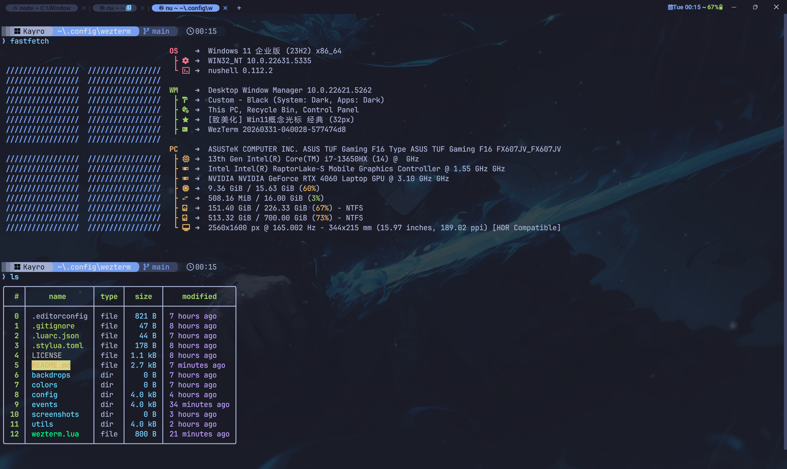

<div align="center">

# WezTerm 配置

<p>
  
</p>

<p>
  <strong>Tokyo Night 配色</strong> · JetBrainsMono NF 12pt
</p>

</div>

## 目录结构

```
wezterm.lua              ← 入口
colors/custom.lua       ← Tokyo Night 配色
config/                  ← 外观 · 快捷键 · 字体 · 通用
events/                  ← 状态栏 · 标签 · 启动
utils/                   ← 背景 · GPU · 工具
backdrops/               ← 背景图片
screenshots/             ← 截图
```

## 前提条件

- [](https://wezterm.org/installation.html)
- [](https://github.com/ryanoasis/nerd-fonts)

## 使用

```sh
git clone https://github.com/jeoor/wezterm-config.git ~/.config/wezterm
```

## 配色

全部色值来自 [Tokyo Night](https://github.com/enkia/tokyo-night-vscode-theme) 官方主题。

## 快捷键

### 通用

| 快捷键 | 功能 |
|---|---|
| `Ctrl+F1` | 复制模式 |
| `Ctrl+F2` | 命令面板 |
| `Ctrl+F3` | 启动器 |
| `Ctrl+F4` | 标签导航 |
| `Ctrl+F5` | 工作区 |
| `Ctrl+F11` / `Ctrl+F12` | 全屏 / 调试 |
| `Ctrl+F` | 搜索 |
| `Shift+Ctrl+O` | 打开 URL |

### 标签页

| 快捷键 | 功能 |
|---|---|
| `Ctrl+T` | 新建 |
| `Shift+Ctrl+T` / `U` | WSL:Arch / WSL:Ubuntu |
| `Shift+Ctrl+W` | 关闭 |
| `Ctrl+[` / `Ctrl+]` | 切换 |
| `Shift+Ctrl+[` / `Shift+Ctrl+]` | 移动 |
| `Ctrl+1..8` | 切换到第 N 个 |
| `Ctrl+0` / `Shift+Ctrl+R` | 重命名 |
| `Shift+Ctrl+0` | 撤销改名 |
| `Ctrl+9` | 隐藏/显示标签栏 |

### 窗格

| 快捷键 | 功能 |
|---|---|
| `Ctrl+Alt+/` `\` `-` | 分屏 / 关闭 |
| `Ctrl+Alt+Z` · `Ctrl+Enter` · `Ctrl+W` | 缩放 / 关闭 |
| `Shift+↑↓←→` | 导航 |
| `Shift+Ctrl+H/J/K/L` | Vim 导航 |
| `Shift+Ctrl+P` | 交换窗格 |
| `Ctrl+Alt+↑↓←→` | 调整大小 |

### 滚动 / 字体 / 背景

| 快捷键 | 功能 |
|---|---|
| `Alt+U` / `Alt+D` | 滚动 5 行 |
| `PageUp` / `PageDown` | 翻页 |
| `Ctrl+↑` `Ctrl+↓` · `Ctrl+R` | 字体缩放 / 重置 |
| `Ctrl+/` `Ctrl+,` `Ctrl+.` `Ctrl+B` | 背景随机 / 循环 / 专注 |
| `Shift+Ctrl+/` | 模糊搜索背景 |

### Leader 模式

`Shift+Ctrl+Space` 进入，然后 `f` 字体 / `p` 窗格，`j/k/h/l` 调整，`Esc/q` 退出。

### 鼠标

`Ctrl+左键` 开链接 · 右键粘贴 · 双击选词 · 三击选行 · 滚轮滚动

## 致谢

- [KevinSilvester/wezterm-config](https://github.com/KevinSilvester/wezterm-config)
- [QianSong1/wezterm-config](https://github.com/QianSong1/wezterm-config)
- [Tokyo Night Theme](https://github.com/enkia/tokyo-night-vscode-theme)
